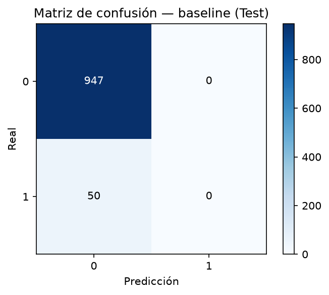

# Informe — Análisis de la Matriz de Confusión del Baseline

**Proyecto:** F5 RiskAI
**Fase:** Análisis de errores de clasificación (ML)
**Artefacto evaluado:** `artifacts\logistic_regression_baseline.joblib`
**Fuente de datos:** `data\raw\stroke_dataset.csv`

> Este informe analiza los errores del baseline entrenado en #017, usando el mismo split y configuración de #016–#018. Es descriptivo; no modifica el modelo ni afirma causalidad médica.

## 1. Objetivo

Comprender los tipos de error del baseline (``LogisticRegression``) sobre Test, desglosando la matriz de confusión en TN/FP/FN/TP y relacionándola con Precision/Recall/F1 de la clase positiva `stroke=1`.

## 2. Modelo utilizado

- Pipeline de scikit-learn = ``preprocessing`` + ``LogisticRegression`` (artefacto #017), cargado tal cual.
- **Estado:** sin modificar; no se reentrena, no se balancea, no se ajusta el threshold.

## 3. Dataset y split

- 4981 registros; target `stroke`: `0`≈95.02%, `1`≈4.98%.
- **Split:** `train_test_split(test_size=0.2, random_state=42, stratify=y)`.
  - Train: 3984 filas.
  - Test: 997 filas.

## 4. Confusion matrix (Test)

|  | Pred: 0 | Pred: 1 |
|---|---|---|
| **Real: 0** | 947 | 0 |
| **Real: 1** | 50 | 0 |

Convención de clases: `[0, 1]` = [`no stroke`, `stroke`].

## 5. TN / FP / FN / TP

### 5.1 Test

| TN (negativos correctos) | 947 |
| FP (falsas alarmas) | 0 |
| FN (ictus no detectados) | 50 |
| TP (ictus detectados) | 0 |

### 5.2 Train (referencia)

| TN (negativos correctos) | 3786 |
| FP (falsas alarmas) | 0 |
| FN (ictus no detectados) | 197 |
| TP (ictus detectados) | 1 |

## 6. Interpretación de errores

- Sobre los 50 casos reales de `stroke` en Test (soporte `1`), el modelo **detectó (TP) 0** y **no identificó (FN) 50**.
- Se **produjeron 0 falsas alarmas** (casos `stroke=0` clasificados como `1`) y el modelo **clasificó correctamente (TN) 947** negativos.
- El modelo emite 0 predicciones `1` y 997 predicciones `0`: en Test, **predice mayoritariamente la clase `0`** (997/997), coherente con el fuerte desbalance.
- Dado el desbalance (~95/5), la clase minoritaria apenas se predice en decisión binaria, concentrando los errores en **FN (ictus no detectados)**.

## 7. Relación con Precision / Recall / F1

### 7.1 Test

- **Precision** (TP/(TP+FP)) = 0.0000.
- **Recall** (TP/(TP+FN)) = 0.0000.
- **F1-score** = 0.0000.

### 7.2 Train

- **Precision** = 1.0000; **Recall** = 0.0051; **F1** = 0.0101.

_Nota: estas métricas se derivan de la matriz de confusión y son coherentes con las reportadas en #018._

## 8. Principales conclusiones

- El baseline **clasifica correctamente la mayoría de negativos** (TN=947) e incurre en pocas falsas alarmas (FP=0).
- El principal problema es la **perdida de la clase positiva**: FN=50 de 50 casos de `stroke` en Test.
- Esto refleja que, sin tratamiento del desbalance, el baseline predice casi siempre la clase mayoritaria; el Recall de `stroke=1` es muy bajo.
- En consecuencia, se priorizará en #019/#020 analizar estrategias de balanceo y el gap Train/Test para mejorar la detección de `stroke=1`.