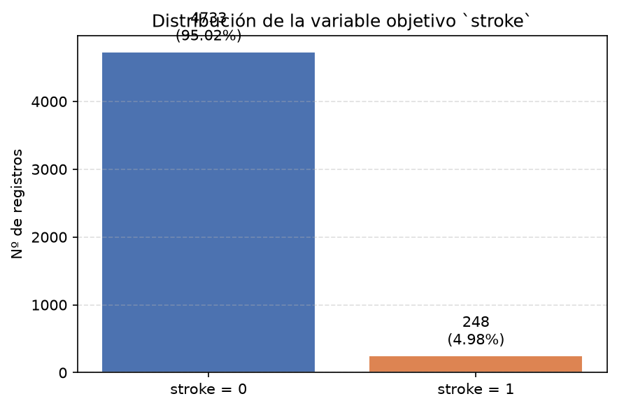
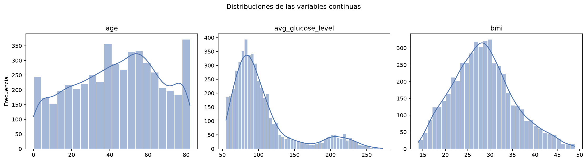
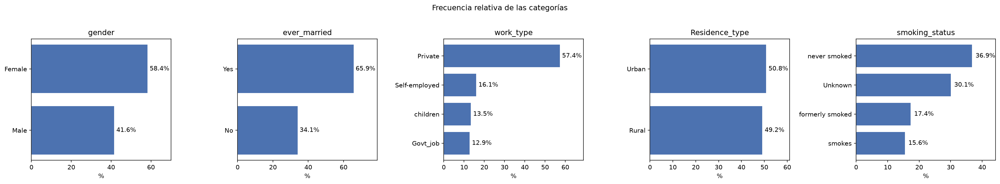

# Informe EDA — F5 RiskAI

**Proyecto:** F5 RiskAI
**Fase:** Exploratory Data Analysis (EDA) — informe consolidado
**Fuente:** `data\raw\stroke_dataset.csv`
**Registros:** 4981 · **Variables:** 11

> Este documento consolida los hallazgos de los Issues #010–#014 y cierra formalmente la fase de EDA, dejando la base para la siguiente etapa de Machine Learning. Nada aquí constituye evidencia médica ni afirmación causal.

## 1. Resumen ejecutivo

El dataset contiene 4981 registros (0 valores nulos y 0 duplicados, ver `dataset-inspection.md`). La variable objetivo `stroke` presenta un claro desbalance: la clase mayoritaria `0` supone el 95.02% frente al 4.98% de la clase minoritaria `1` (ratio 19.08x).

Las variables continuas muestran distribuciones distintas: `age` es aproximadamente simétrica; `avg_glucose_level` tiene fuerte asimetría positiva con numerosos valores extremos; `bmi` es casi simétrica. En cuanto a la relación con `stroke`, la edad destaca con un efecto grande (Cohen's d ≈ 1.17), seguida de la glucosa (efecto medio) y el IMC (efecto pequeño).

Entre las categóricas, estar casado (`ever_married`) y el tipo de empleo (`work_type`) muestran las mayores diferencias entre clases, mientras que `gender` y `Residence_type` apenas discriminan.

### Índice

1. [Resumen ejecutivo](#1-resumen-ejecutivo)
2. [Datos y calidad](#2-datos-y-calidad)
3. [Desbalance de clases](#3-desbalance-de-clases)
4. [Distribución de las variables](#4-distribución-de-las-variables)
5. [Relaciones con `stroke`](#5-relaciones-con-stroke)
6. [Frecuencias de categorías](#6-frecuencias-de-categorías)
7. [Conclusiones y siguientes pasos](#7-conclusiones-y-siguientes-pasos)

## 2. Datos y calidad

### 2.1 Dataset

- **Fuente:** `data/raw/stroke_dataset.csv` (4981 filas, 11 columnas).
- **Preprocesamiento:** flujo en `scripts/preprocessing.py` y `generate_processed_data.py`.
- **Calidad:** 0 valores nulos y 0 duplicados (ver `reports/dataset-inspection.md` y `reports/missing-values-and-duplicates.md`).

### 2.2 Variables

**Continuas**

| Variable | count | media | mediana | std | asimetría | min | max |
|---|---|---|---|---|---|---|---|
| age | 4981 | 43.42 | 45.00 | 22.66 | -0.14 | 0.1 | 82.0 |
| avg_glucose_level | 4981 | 105.94 | 91.85 | 45.08 | +1.59 | 55.1 | 271.7 |
| bmi | 4981 | 28.50 | 28.10 | 6.79 | +0.37 | 14.0 | 48.9 |

**Binarias (0/1):** `hypertension`, `heart_disease`.

**Categóricas:** `gender`, `ever_married`, `work_type`, `Residence_type`, `smoking_status`.

## 3. Desbalance de clases

- **Clase mayoritaria:** `0` (4733 registros, 95.02%).
- **Clase minoritaria:** `1` (248 registros, 4.98%).
- **Ratio de desbalance (mayoritaria / minoritaria):** 19.08x.

**Implicación:** una evaluación ingenua de la accuracy sería engañosa (un clasificador trivial alcanzará ~95.0% sin aprender). La evaluación deberá priorizar recall/sensibilidad, precisión, F1 y análisis ROC/PR sobre la clase minoritaria.

## 4. Distribución de las variables

- **`age`:** aproximadamente simétrica, con un ligero ensanchamiento en las edades extremas; sin valores atípicos relevantes.
- **`avg_glucose_level`:** asimetría positiva pronunciada; la regla del IQR señala ~12% de posibles valores extremos en el extremo alto.
- **`bmi`:** casi simétrica, con pocos valores extremos por IQR (~1%).

### Frecuencia de las categorías

- **`gender`:** categoría dominante `Female` con 58.4% (2907 de 4981).
- **`ever_married`:** categoría dominante `Yes` con 65.9% (3280 de 4981).
- **`work_type`:** categoría dominante `Private` con 57.4% (2860 de 4981).
- **`Residence_type`:** categoría dominante `Urban` con 50.8% (2532 de 4981).
- **`smoking_status`:** categoría dominante `never smoked` con 36.9% (1838 de 4981).

## 5. Relaciones con `stroke`

### 5.1 Continuas (Cohen's d: `1` vs `0`)

| Variable | media en `0` | media en `1` | Δ media | Cohen's d |
|---|---|---|---|---|
| age | 42.141 | 67.82 | +25.678 | +1.169 (grande) |
| avg_glucose_level | 104.569 | 132.176 | +27.607 | +0.618 (medio) |
| bmi | 28.41 | 30.187 | +1.777 | +0.262 (pequeño) |

Los mayores efectos sobre `stroke` son la **edad** (d grande) y la 
**glucosa** (d medio); el IMC aporta un efecto pequeño.

### 5.2 Binarias

- **`hypertension`:** prevalencia 26.6% en `stroke=1` vs 8.7% en `stroke=0` (Δ +0.179).
- **`heart_disease`:** prevalencia 19.0% en `stroke=1` vs 4.8% en `stroke=0` (Δ +0.141).

`hypertension` y `heart_disease` son más prevalentes en la clase `1`.

### 5.3 Categóricas

Las mayores diferencias entre clases se observan en `ever_married` (`No` -23.6 pp, `Yes` +23.6 pp) y `work_type` (`children` -13.4 pp, `Self-employed` +10.6 pp); `gender` y `Residence_type` apenas discriminan.

## 6. Frecuencias de categorías

Las tablas de frecuencia por categoría se detallan en `reports/feature-distributions.md` y las diferencias entre clases en `reports/feature-relationships.md`. Los gráficos del apartado 4 y 5 resumen las frecuencias y sus diferencias según `stroke`.

## 7. Conclusiones y siguientes pasos

**Hallazgos clave**

- Fuerte desbalance en `stroke` (~95/5), con ratio ≈ 19x.
- `age` es la variable con mayor poder discriminativo (d ≈ 1.17).
- `avg_glucose_level` asimétrica con outliers; `bmi` casi simétrica.
- `hypertension`, `heart_disease` y `ever_married` asociados a mayor riesgo.
- `gender` y `Residence_type` aportan poca discriminación.

**Siguientes pasos (Machine Learning)**

- Usar división estratificada por `stroke` (ya implementada en `generate_processed_data.py`).
- Evaluar con métricas sensibles al desbalance (recall, F1, ROC/PR) y no solo con accuracy.
- Considerar técnicas específicas para el desbalance en el modelado (ponderación de clases, muestreo, etc.), fuera del alcance del EDA.

---

**Archivos de EDA relacionados**

- `reports/descriptive-statistics.md` (#010)
- `reports/class-imbalance.md` (#011)
- `reports/feature-distributions.md` (#012)
- `reports/feature-relationships.md` (#013)
- `reports/visualizations.md` y `reports/figures/` (#014)